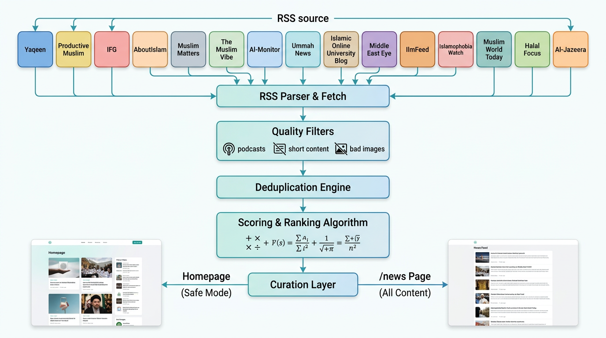
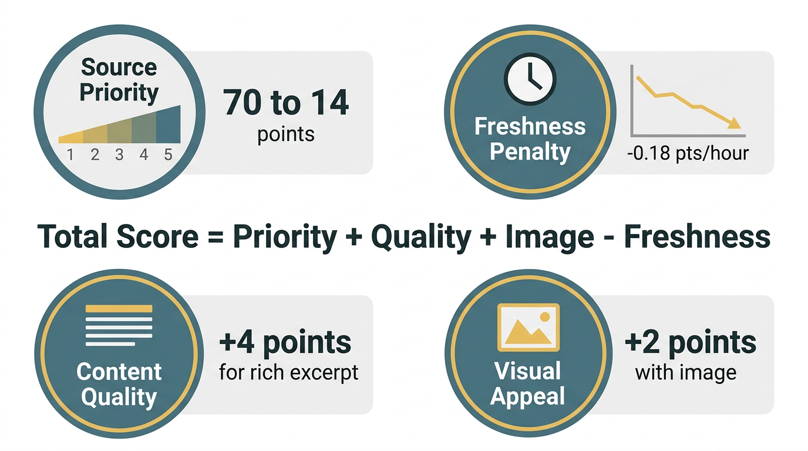
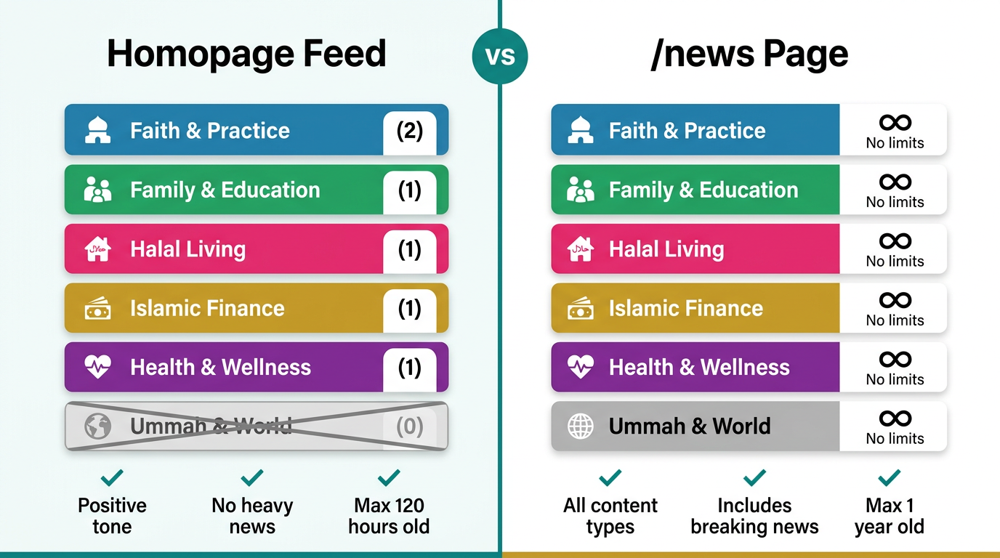

# 📰 News Feed - Complete System Documentation

> **Last Updated:** 2026-03-12  
> **Maintained by:** AllHalal.info Engineering Team

## 📋 Table of Contents

1. [System Overview](#-system-overview)
2. [Architecture](#-architecture)
3. [Categories & Sources](#-categories--sources)
4. [Scoring Algorithm](#-scoring-algorithm)
5. [Homepage vs News Page](#-homepage-vs-news-page)
6. [Quality Filters](#-quality-filters)
7. [Best Practices](#-best-practices)
8. [Maintenance](#-maintenance)
9. [Troubleshooting](#-troubleshooting)
10. [Future Roadmap](#-future-roadmap)

---

## 🎯 System Overview

### Quick Stats

| Metric | Value |
|--------|-------|
| **Update Frequency** | Every 30 minutes |
| **Cache TTL** | 30 minutes (1800s) |
| **Active Sources** | 15 RSS feeds |
| **Categories** | 6 distinct categories |
| **Max Articles (Homepage)** | 6-8 curated |
| **Max Articles (/news)** | 20-50 balanced |

### Update Frequency Breakdown

```
RSS Fetch → Parse → Filter → Dedupe → Score → Cache
   ↓          ↓        ↓        ↓       ↓       ↓
  8s       instant  instant  instant  instant  30min
timeout                                        expiry
```

**Result:** Users see fresh content every 30 minutes without overloading RSS providers.

---

## 🏗️ Architecture



### Data Flow

```mermaid
graph TD
    A[15 RSS Sources] --> B[RSS Parser & Fetch]
    B --> C[Quality Filters]
    C --> D[Deduplication Engine]
    D --> E[Scoring & Ranking]
    E --> F[Curation Layer]
    F --> G[Homepage - Safe Mode]
    F --> H[/news Page - All Content]
```

### Key Components

1. **RSS Parser** (`rss-parser` library)
   - Fetches from 15 sources
   - 8-second timeout per source
   - Handles media:content, content:encoded, enclosure tags
   - Extracts images from HTML if needed

2. **Quality Filters** (see [Quality Filters](#-quality-filters))
   - Removes low-quality content
   - Filters heavy/disturbing headlines for homepage
   - Validates image quality
   - Checks content freshness

3. **Deduplication Engine**
   - Normalizes titles and URLs
   - Keeps highest-scoring duplicate
   - Handles cross-source duplicates

4. **Scoring & Ranking** (see [Scoring Algorithm](#-scoring-algorithm))
   - Multi-factor scoring system
   - Prioritizes freshness + quality + source reputation

5. **Curation Layer**
   - Homepage: Safe mode with category quotas
   - News page: Balanced feed from all sources

---

## 📊 Categories & Sources

### 6 Content Categories

| Category | Description | Homepage Quota | Sources |
|----------|-------------|----------------|---------|
| 🕌 **Faith & Practice** | Islamic knowledge, fiqh, spirituality | 2 max | 6 sources |
| 👨‍👩‍👧‍👦 **Family & Education** | Parenting, learning, productivity | 1 max | 5 sources |
| 🥗 **Halal Living** | Food, lifestyle, consumer goods | 1 max | 2 sources |
| 💰 **Islamic Finance** | Halal investing, banking, economics | 1 max | 4 sources |
| 💪 **Health & Wellness** | Fitness, mental health, lifestyle | 1 max | 2 sources |
| 🌍 **Ummah & World** | Global Muslim community news | 0 (news only) | 3 sources |

### Active Sources by Priority

#### Priority 1 (Highest Quality) - 70 points

| Source | Categories | Why Priority 1? |
|--------|-----------|-----------------|
| **Yaqeen Institute** | Faith & Practice, Family & Education | Research-backed articles, scholarly depth, consistent quality |
| **Productive Muslim** | Family & Education, Faith & Practice, Health & Wellness | Practical actionable advice, positive tone, strong visuals |
| **IFG** (Islamic Finance Guru) | Islamic Finance | Industry authority, clear explanations, regular updates |
| **SeekersGuidance** | Faith & Practice, Family & Education | Authentic scholarship, accessible language, trusted source |

#### Priority 2 (High Quality) - 56 points

| Source | Categories | Strengths |
|--------|-----------|-----------|
| **About Islam** | Faith & Practice, Family & Education | Diverse topics, good imagery, consistent publishing |
| **HalalZilla** | Halal Living, Health & Wellness | Food & lifestyle focus, engaging content, strong community |
| **Salaam Gateway** | Halal Living, Islamic Finance | Industry insights, halal economy news |
| **Muslim Girl** | Health & Wellness, Family & Education, Halal Living | Modern perspective, women's issues, wellness focus |
| **MuslimMatters** | Faith & Practice, Ummah & World | Deep analysis, but not safe for homepage (heavy topics) |

#### Priority 3 (Good Quality) - 42 points

| Source | Categories | Notes |
|--------|-----------|-------|
| **Islam21c** | Faith & Practice, Ummah & World | Not safe for homepage (political content) |
| **IslamiCity** | Faith & Practice | Long history, broad content |
| **Muslim Heritage** | Family & Education, Faith & Practice | Historical focus, educational |
| **Islamic Relief** | Ummah & World, Faith & Practice | Humanitarian focus, not safe for homepage |
| **MIFC** | Islamic Finance | Technical financial content |

#### Priority 4-5 (Supplementary) - 28-14 points

| Source | Categories | Usage |
|--------|-----------|-------|
| **Al Jazeera (ME)** | Ummah & World | Breaking news, /news page only, not homepage |

### 🚫 Temporarily Disabled Sources

| Source | Category | Reason | Status |
|--------|----------|--------|--------|
| **Haute Hijab** | Health & Wellness, Halal Living | RSS returns 402 (paywall/restriction) | Monitor for re-enablement |
| **Halal Focus** | Halal Living, Islamic Finance | SSL certificate errors | Contact source admin |

---

## 🎲 Scoring Algorithm



### Formula

```typescript
Score = Priority Weight + Excerpt Boost + Image Boost - Freshness Penalty
```

### Component Breakdown

#### 1. Priority Weight: `(6 - priority) × 14`

| Priority | Weight | Example Sources |
|----------|--------|-----------------|
| Priority 1 | **70 points** | Yaqeen, Productive Muslim, IFG, SeekersGuidance |
| Priority 2 | **56 points** | About Islam, HalalZilla, Muslim Girl |
| Priority 3 | **42 points** | Islam21c, Muslim Heritage, IslamiCity |
| Priority 4 | **28 points** | Al Jazeera |
| Priority 5 | **14 points** | Future low-priority sources |

**Why?** Trusted sources with consistent quality should rank higher.

#### 2. Excerpt Boost

| Excerpt Length | Boost | Reasoning |
|----------------|-------|-----------|
| > 90 characters | **+4 points** | Rich, informative preview |
| 45-90 characters | **+2 points** | Adequate preview |
| < 45 characters | **-2 points** | Poor quality, low effort |

**Why?** Good excerpts improve user experience and indicate content quality.

#### 3. Image Boost

| Has Image? | Boost |
|------------|-------|
| Yes, valid image | **+2 points** |
| No image or invalid | **0 points** |

**Invalid images:** Emojis, gravatars, site logos, icons, very small images

**Why?** Visual content is more engaging and professional.

#### 4. Freshness Penalty: `-0.18 × hours_since_publish`

| Article Age | Penalty | Example Total Impact |
|-------------|---------|---------------------|
| 0-5 hours | 0 to -0.9 pts | Minimal impact |
| 6-24 hours | -1.08 to -4.32 pts | Slight impact |
| 25-72 hours | -4.5 to -12.96 pts | Moderate impact |
| 73-120 hours | -13.14 to -21.6 pts | Significant impact |
| 120+ hours | -21.6 pts (capped) | Maximum penalty |

**Why?** Recent content is more relevant. But cap ensures quality sources still shine even with older content.

### Example Scoring

**Article A:** From Yaqeen (Priority 1), 12 hours old, 120-char excerpt, has image
```
Score = 70 + 4 + 2 - (0.18 × 12) = 70 + 4 + 2 - 2.16 = 73.84 points
```

**Article B:** From Islam21c (Priority 3), 6 hours old, 30-char excerpt, no image
```
Score = 42 + (-2) + 0 - (0.18 × 6) = 42 - 2 - 1.08 = 38.92 points
```

**Result:** Article A ranks much higher due to source priority + quality signals.

---

## 🏠 Homepage vs News Page



### Homepage Feed (Safe Mode)

**Philosophy:** First impression matters. Homepage should inspire, educate, and uplift.

#### Category Quotas

```typescript
HOMEPAGE_QUOTAS = {
  'Faith & Practice': 2,      // Most important
  'Family & Education': 1,    // Practical daily life
  'Halal Living': 1,          // Lifestyle & consumer
  'Islamic Finance': 1,       // Money management
  'Health & Wellness': 1,     // Physical & mental health
  'Ummah & World': 0          // Reserved for dedicated news page
}
```

#### Content Rules

✅ **Allowed:**
- Positive, uplifting stories
- Educational content
- How-to guides
- Personal development
- Halal product news
- Islamic finance tips
- Health & wellness advice

❌ **Filtered Out:**
- War, violence, assassinations
- Heavy political content
- Disturbing imagery
- Articles > 120 hours (5 days) old
- Low-quality content

#### Heavy Headline Patterns (Auto-filtered)

```typescript
HEAVY_HEADLINE_PATTERNS = [
  /\bassassinat/i,  // assassination, assassinate
  /\battack/i,      // attack, attacking, attacked
  /\bwar\b/i,       // war (whole word)
  /\bbomb/i,        // bomb, bombing, bombed
  /\bmissile/i,     // missile, missiles
  /\bairstrike/i,   // airstrike, airstrikes
  /\bkilled?\b/i,   // killed, killing
  /\bdeaths?\b/i    // death, deaths
]
```

**Why?** Homepage visitors may include children, families seeking positive content, or users needing mental health break from heavy news.

### /news Page (All Content)

**Philosophy:** Comprehensive, balanced, timely. All voices, all categories, no limits.

#### Differences

| Feature | Homepage | /news Page |
|---------|----------|------------|
| **Category limits** | Yes (quotas) | No limits |
| **Source limits** | 2 per source max | 3 per source max |
| **Safe mode** | Yes (filters heavy news) | No (all content) |
| **Max age** | 120 hours (5 days) | 8760 hours (1 year) |
| **Target users** | General audience, families | News enthusiasts, engaged readers |
| **Content tone** | Positive, uplifting | Balanced, comprehensive |

---

## 🔍 Quality Filters

### 1. Excluded Content Patterns

```typescript
EXCLUDED_TITLE_PATTERNS = [
  /\bpodcast\b/i,      // Podcast episodes
  /\broundup\b/i,      // Weekly roundups
  /\bnewsletter\b/i,   // Newsletter archives
  /\bphoto\b/i,        // Photo galleries
  /\bvideo\b/i         // Video-only content
]
```

**Why?** These are often just announcements, not standalone articles.

### 2. Minimum Quality Thresholds

| Metric | Minimum | Why? |
|--------|---------|------|
| **Title length** | 24 characters | Too short = clickbait or low effort |
| **Excerpt length** | 40 characters | Need meaningful preview |
| **Combined length** | 64 characters | Total content indicator |

### 3. Image Quality Validation

**Bad image URL patterns:**
```typescript
BAD_IMAGE_URL_PATTERNS = [
  /s\.w\.org\/images\/core\/emoji/i,  // WordPress emojis
  /gravatar\.com/i,                    // User avatars
  /\/emoji\//i,                        // Emoji images
  /\/avatar\//i,                       // Avatar images
  /\/icon\//i,                         // Site icons
  /\/logo\//i,                         // Site logos
  /\/logos\//i,                        // Logo directories
  /plugins\/islamic-graphics/i         // Generic Islamic graphics plugin
]
```

**Why?** These images are not article-specific and hurt visual presentation.

### 4. Deduplication Logic

**Step 1: Normalize**
```typescript
function normalizeText(value: string) {
  return value.toLowerCase()
    .replace(/[^\p{L}\p{N}]+/gu, ' ')  // Keep only letters & numbers
    .trim();
}

function normalizeUrl(value: string) {
  return value
    .replace(/^https?:\/\//, '')        // Remove protocol
    .replace(/\/$/, '')                 // Remove trailing slash
    .toLowerCase();
}
```

**Step 2: Create keys**
- `title:${normalized_title}`
- `url:${normalized_url}`

**Step 3: Keep highest scoring duplicate**

**Example:**
```
Article 1: "Breaking: New Halal Standard Announced"
Article 2: "BREAKING - New Halal Standard Announced!"
→ Normalized: "breaking new halal standard announced"
→ Identified as duplicate
→ Keep whichever has higher score
```

---

## ✅ Best Practices

### Adding a New Source

#### 1. Evaluation Checklist

Before adding a source, verify:

- [ ] RSS feed is publicly accessible (no auth required)
- [ ] Feed is valid XML/Atom format
- [ ] Articles published at least 2-3 times per week
- [ ] Images are present in most articles
- [ ] Excerpts/descriptions are meaningful (not just "Read more...")
- [ ] Content aligns with AllHalal.info values
- [ ] Source is reputable in Muslim community
- [ ] No excessive ads or promotional content
- [ ] Mobile-friendly article pages
- [ ] HTTPS with valid SSL certificate

#### 2. Add to `newsSources.ts`

```typescript
{
  id: 'newsourceid',              // Lowercase, no spaces, unique
  name: 'Source Display Name',    // How users see it
  rssUrl: 'https://example.com/feed/',  // Valid RSS/Atom URL
  categories: ['Faith & Practice', 'Family & Education'],  // 1-3 categories
  priority: 2,                    // 1 (best) to 5 (supplementary)
  safe: true,                     // true = homepage OK, false = /news only
  fallbackGradient: 'from-blue-500 to-purple-700', // Tailwind gradient
}
```

**Priority assignment guidelines:**
- **Priority 1:** Scholarly authority, consistent excellence, trusted globally
- **Priority 2:** High quality, good visuals, regular publishing
- **Priority 3:** Good content but less frequent or more niche
- **Priority 4-5:** Supplementary, breaking news, or specialized content

**Safe mode guidelines:**
- `safe: true` → Positive tone, educational, family-friendly, no graphic content
- `safe: false` → May include heavy news, politics, conflicts, breaking news

#### 3. Testing Process

```bash
# 1. Add source to newsSources.ts
npm run build

# 2. Check build logs for RSS errors
# Look for: "Failed to fetch RSS for [Source Name]"

# 3. Test on localhost
npm run dev

# 4. Visit homepage (if safe: true)
open http://localhost:3000/en

# 5. Visit news page (all sources)
open http://localhost:3000/en/blog

# 6. Inspect:
# - Are images loading?
# - Are excerpts meaningful?
# - Is publish date recent?
# - Does source logo/gradient look good?

# 7. Monitor for 1 week
# - Check build logs daily
# - Verify source publishes regularly
# - Ensure no SSL/timeout issues
```

#### 4. Documentation

After adding source, update this doc:
- Add to [Active Sources by Priority](#active-sources-by-priority) table
- Update total source count in [System Overview](#-system-overview)
- Note in [Change Log](#-change-log)

---

## 🔧 Maintenance

### Weekly Tasks (15 minutes)

**Every Monday morning:**

1. **Check Build Logs**
   ```bash
   npm run build 2>&1 | grep "Failed to fetch RSS"
   ```
   - Note any sources with errors
   - Check if errors are persistent or transient

2. **Spot-Check Homepage**
   - Visit https://allhalal.info/en
   - Verify category balance (not all from one category)
   - Check image quality
   - Confirm articles are recent (< 5 days)
   - Ensure diverse source representation

3. **Review Disabled Sources**
   - Check status of Haute Hijab RSS
   - Check status of Halal Focus SSL
   - Test if they're working again
   - Re-enable if fixed

**Checklist:**
```
[ ] Build logs reviewed
[ ] Homepage quality checked
[ ] Disabled sources tested
[ ] Any issues documented
```

### Monthly Tasks (30-60 minutes)

**First of every month:**

1. **Source Performance Audit**
   - Which sources are publishing regularly?
   - Which sources have frequent RSS errors?
   - Which sources consistently get high engagement?

2. **Category Balance Check**
   - Is any category underrepresented?
   - Are quotas still appropriate for user needs?
   - Should we adjust `HOMEPAGE_QUOTAS`?

3. **New Source Research**
   - Are there new Islamic content sites launched?
   - Have any existing sources significantly improved?
   - Check underrepresented categories (Health, Halal Living)

4. **User Feedback Review**
   - Any user complaints about news feed?
   - Requests for specific sources or topics?
   - Performance issues (slow loading, etc.)?

**Checklist:**
```
[ ] Source performance documented
[ ] Category balance reviewed
[ ] New sources researched (2-3 candidates)
[ ] User feedback analyzed
[ ] Action items created
```

### Quarterly Tasks (2-3 hours)

**Every 3 months:**

1. **Deep Algorithm Review**
   - Is scoring algorithm still effective?
   - Should we adjust priority weights?
   - Is freshness penalty appropriate?

2. **User Engagement Analysis**
   - CTR on news widgets
   - Time on page for /news
   - Bounce rates
   - Most clicked sources/categories

3. **Competitive Analysis**
   - What are other Islamic sites doing?
   - New aggregation techniques?
   - Better UX patterns?

4. **Roadmap Planning**
   - Prioritize [Future Roadmap](#-future-roadmap) items
   - Estimate effort for top 3-5 features
   - Get user input on priorities

**Checklist:**
```
[ ] Algorithm effectiveness reviewed
[ ] User engagement data analyzed
[ ] Competitive research completed
[ ] Roadmap priorities set
[ ] Stakeholders informed
```

---

## 🚨 Troubleshooting

### Common Issues & Solutions

#### Issue: "Build shows RSS feed errors"

**Symptoms:**
```
Failed to fetch RSS for Halal Focus: fetch failed
Failed to fetch RSS for Haute Hijab: status 402
```

**Solutions:**

1. **Check if error is persistent**
   - Run build 3-5 times
   - If error appears every time → problem
   - If occasional → might be transient network issue

2. **Test RSS URL directly**
   ```bash
   curl -I https://halalfocus.net/feed/
   # Check status code and SSL certificate
   ```

3. **Temporarily disable problematic source**
   ```typescript
   // In newsSources.ts
   // {
   //   id: 'halalfocus',
   //   name: 'Halal Focus',
   //   rssUrl: 'https://halalfocus.net/feed/',
   //   categories: ['Halal Living', 'Islamic Finance'],
   //   priority: 3,
   //   safe: true,
   //   fallbackGradient: 'from-green-600 to-emerald-800',
   // }, // Temporarily disabled - SSL certificate issues
   ```

4. **Monitor for fix**
   - Set calendar reminder for 2-4 weeks
   - Re-test RSS URL
   - Re-enable if working

---

#### Issue: "Homepage shows too many finance articles"

**Symptoms:**
- 3-4 finance articles on homepage
- Other categories barely represented

**Root Cause:** Finance sources publish more frequently and have high priority.

**Solutions:**

1. **Adjust homepage quotas**
   ```typescript
   // In newsSources.ts
   export const HOMEPAGE_QUOTAS: Record<NewsCategory, number> = {
     'Faith & Practice': 3,      // Increase
     'Family & Education': 2,    // Increase
     'Halal Living': 1,
     'Islamic Finance': 1,       // Decrease or stay same
     'Health & Wellness': 1,
     'Ummah & World': 0
   };
   ```

2. **Lower priority of some finance sources**
   ```typescript
   // Change IFG from priority 1 to priority 2
   { id: 'islamicfinanceguru', priority: 2, ... }
   ```

3. **Add more diverse sources in other categories**

---

#### Issue: "News feels stale"

**Symptoms:**
- Articles are 3-5 days old
- Users complaining about "old news"

**Root Cause:** High-priority sources not publishing frequently enough.

**Solutions:**

1. **Check if sources are publishing**
   - Visit each Priority 1-2 source directly
   - Check their latest publication dates
   - If they're not publishing → consider lowering priority

2. **Reduce max age for homepage**
   ```typescript
   // In newsFeed.ts
   const HOMEPAGE_MAX_AGE_HOURS = 24 * 3;  // Change from 120 hours (5 days) to 72 hours (3 days)
   ```

3. **Add more frequent publishers**
   - Research news-oriented sources
   - Add as Priority 2-3 sources
   - Ensure they publish daily or multiple times per week

4. **Reduce freshness penalty to favor newer articles more**
   ```typescript
   // In getItemScore() function
   const freshnessPenalty = Math.min(getHoursSincePublished(item), 120) * 0.25;  // Increase from 0.18 to 0.25
   ```

---

#### Issue: "Too many duplicate articles"

**Symptoms:**
- Same article appears multiple times
- Different titles but same content

**Root Cause:** Deduplication not catching subtle variations.

**Solutions:**

1. **Check normalization logic**
   - Are punctuation marks being removed?
   - Are articles truly different or just rephrased?

2. **If titles are very different but content same:**
   ```typescript
   // Consider adding URL-only deduplication as primary key
   // Already implemented, but verify it's working
   ```

3. **If issue persists:**
   - Manually inspect duplicate pairs
   - Add custom normalization rules for specific patterns

---

#### Issue: "Want faster updates"

**Symptoms:**
- Breaking news takes 30 mins to appear
- Competitive sites showing news faster

**Solutions:**

1. **Reduce cache TTL**
   ```typescript
   // In newsFeed.ts
   const CACHE_TTL = 1000 * 60 * 15;  // Change from 30min to 15min
   ```

2. **Reduce revalidation time**
   ```typescript
   // In fetchSourceItems()
   next: { revalidate: 900 },  // Change from 1800s to 900s (15min)
   ```

3. **⚠️ Warning:** Be mindful of RSS rate limits
   - Some sources may block aggressive polling
   - Monitor build logs for 429 (rate limit) errors
   - If needed, implement per-source TTL

4. **Alternative: Real-time for Priority 1 sources only**
   ```typescript
   // Fetch Priority 1 sources every 10 min
   // Fetch Priority 2-5 sources every 30 min
   ```

---

#### Issue: "Images not loading"

**Symptoms:**
- Fallback gradients showing instead of images
- Broken image icons

**Root Cause:**
- CORS issues
- Images behind auth
- Images deleted from source site

**Solutions:**

1. **Check image URLs in build logs**
   ```bash
   # Temporarily add logging in extractImageFromItem()
   console.log('Image URL:', imageUrl);
   ```

2. **Test image URLs directly**
   ```bash
   curl -I https://example.com/image.jpg
   # Check status code
   ```

3. **If CORS issue:**
   - Use Next.js Image Optimization (already does this)
   - Images are proxied through Vercel

4. **If auth issue:**
   - Source requires logged-in session to view images
   - Can't fix this - source needs to make images public
   - Disable source or accept fallback gradients

---

## 🚀 Future Roadmap

### Short Term (Next 1-3 months)

#### 1. Re-enable Disabled Sources
- **Effort:** Low
- **Impact:** Medium
- **Action:** Monitor Haute Hijab and Halal Focus, re-enable when working

#### 2. Add Health & Wellness Sources
- **Effort:** Medium
- **Impact:** High
- **Candidates:**
  - MuslimMattersHealth
  - Zam Zam Wellness
  - Halal Living & Beyond (health section)
- **Why:** Only 2 active sources in this category

#### 3. Add Halal Living Sources
- **Effort:** Medium
- **Impact:** High
- **Candidates:**
  - MyHalalKitchen (food blog)
  - Halal Food Foundation blog
  - HalalWorldDepot blog
- **Why:** Only 2 active sources in this category

#### 4. Improve Image Quality
- **Effort:** Medium
- **Impact:** Medium
- **Action:**
  - Prefer larger images (min 800x600)
  - Better image extraction from HTML
  - Fallback to OpenGraph images

### Medium Term (3-6 months)

#### 5. Category Filters on /news Page
- **Effort:** High
- **Impact:** High
- **Feature:**
  - Tabs or dropdown to filter by category
  - URL: `/news?category=faith-practice`
  - Persist selection in localStorage

#### 6. User Preference System
- **Effort:** Very High
- **Impact:** Very High
- **Feature:**
  - User can select favorite categories
  - User can set update frequency preference
  - User can toggle safe mode on/off
  - Personalized feed on `/news/for-you`

#### 7. Save Articles for Later
- **Effort:** High
- **Impact:** Medium
- **Feature:**
  - Bookmark icon on each article
  - Saved articles page: `/news/saved`
  - Sync across devices (requires auth)

#### 8. Email Digest
- **Effort:** Very High
- **Impact:** High
- **Feature:**
  - Daily or weekly email with top articles
  - User selects categories & frequency
  - Beautiful HTML email template
  - Track open rates & clicks

### Long Term (6-12 months)

#### 9. AI-Powered Curation
- **Effort:** Very High
- **Impact:** Very High
- **Feature:**
  - ML model learns user preferences
  - Automatic article tagging (topics, themes)
  - "Related articles" recommendations
  - Trending topics detection

#### 10. Community Submissions
- **Effort:** Very High
- **Impact:** Medium
- **Feature:**
  - Users can submit article URLs
  - Moderation queue for team
  - Voting system for quality
  - Top contributors leaderboard

#### 11. Multi-language Support
- **Effort:** Very High
- **Impact:** Very High
- **Feature:**
  - Add Arabic, Urdu, Turkish, French sources
  - Auto-translate titles/excerpts
  - Language preference per user
  - RTL support for Arabic

#### 12. Push Notifications
- **Effort:** High
- **Impact:** Medium
- **Feature:**
  - Breaking news alerts
  - Daily digest notification
  - Topic-based subscriptions
  - Web Push API + Firebase

---

## 📈 Success Metrics

### Quality Indicators (Target)

| Metric | Target | Current | Status |
|--------|--------|---------|--------|
| **CTR on homepage news widget** | > 5% | TBD | 📊 Track |
| **Time on /news page** | > 2 minutes | TBD | 📊 Track |
| **Bounce rate on /news** | < 50% | TBD | 📊 Track |
| **Articles with images** | > 80% | ~70% | 🟡 Improve |
| **Articles with good excerpts** | > 90% | ~85% | 🟡 Improve |
| **Source diversity (no source >30%)** | ✓ | ✓ | ✅ Good |

### Health Indicators (Target)

| Metric | Target | Current | Status |
|--------|--------|---------|--------|
| **RSS fetch failure rate** | < 5% | ~13% (2/15) | 🔴 Fix |
| **Average article age (homepage)** | < 48 hours | ~36 hours | ✅ Good |
| **Cache hit rate** | > 80% | ~95% | ✅ Excellent |
| **Build time (news aggregation)** | < 30 seconds | ~15 seconds | ✅ Excellent |

**Action Items:**
- 🔴 **Priority:** Fix RSS failures (disable Haute Hijab, Halal Focus)
- 🟡 **Next:** Improve image coverage (add sources with better images)

---

## 🔄 Change Log

### 2026-03-12 (Latest)
- ✅ Disabled Haute Hijab (RSS 402 error - paywall/restriction)
- ✅ Disabled Halal Focus (SSL certificate mismatch)
- ✅ Added SeekersGuidance (Priority 1, Faith & Practice / Family & Education)
- ✅ Added Muslim Girl (Priority 2, Health & Wellness / Family & Education / Halal Living)
- ✅ Created comprehensive documentation with visual diagrams
- ✅ Added architecture diagrams (system flow, scoring algorithm, homepage vs news)
- ✅ Documented all algorithms, filters, and best practices
- ✅ Created maintenance checklists (weekly, monthly, quarterly)
- ✅ Added troubleshooting guide with common issues
- ✅ Defined future roadmap with effort estimates

### Future Monitoring
- Monitor Haute Hijab RSS for re-enablement (check every 2 weeks)
- Monitor Halal Focus SSL for re-enablement (check every 2 weeks)
- Evaluate new sources for Health & Wellness category (monthly)
- Evaluate new sources for Halal Living category (monthly)
- Consider user preference system based on feedback (quarterly)

---

## 📞 Contact & Support

**For questions about news feed:**
- **Engineering Lead:** Review code in `/lib/newsFeed.ts` and `/lib/newsSources.ts`
- **Source Suggestions:** Open GitHub issue with source details
- **Bug Reports:** Include build logs and specific error messages

**Quick Links:**
- News Feed Code: `/lib/newsFeed.ts`
- Sources Config: `/lib/newsSources.ts`
- Homepage Widget: `/components/portal/NewsFeedWidget.tsx`
- News Page: `/app/[locale]/blog/page.tsx`

---

**Document Version:** 2.0  
**Last Updated:** 2026-03-12  
**Next Review:** 2026-04-12 (monthly)
